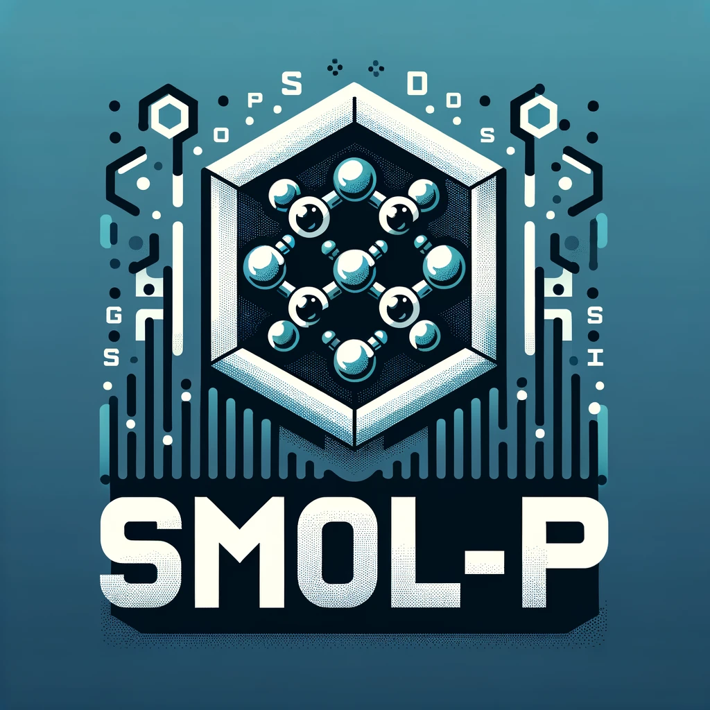

    

# SMOL-P: Small MOLecule Predictors

SMOL-P is a side project aimed at building predictors for small molecule compounds using a chemical checker database. The project focuses on predicting compound bioactivity through an automated machine learning pipeline.

## Project Overview

The goal of SMOL-P is to develop a robust and accurate prediction model for compound bioactivity. By leveraging a chemical checker database, the project aims to train machine learning models that can predict the bioactivity of small molecule compounds.

## Features

- Utilizes a chemical checker database for training and validation
- Implements an automated machine learning pipeline for model development
- Predicts compound bioactivity based on learned patterns and features

## Contributing

Contributions are welcome! If you'd like to contribute to SMOL-P, please follow these guidelines:

1. Fork the repository
2. Create a new branch: `git checkout -b feature/your-feature`
3. Make your changes and commit them: `git commit -m 'Add your feature'`
4. Push to the branch: `git push origin feature/your-feature`
5. Submit a pull request

## License

This project is licensed under the [MIT License](LICENSE).

## Contact

For any questions or inquiries, please contact the project maintainer at dylan.dalton@irbbarcelona.org.